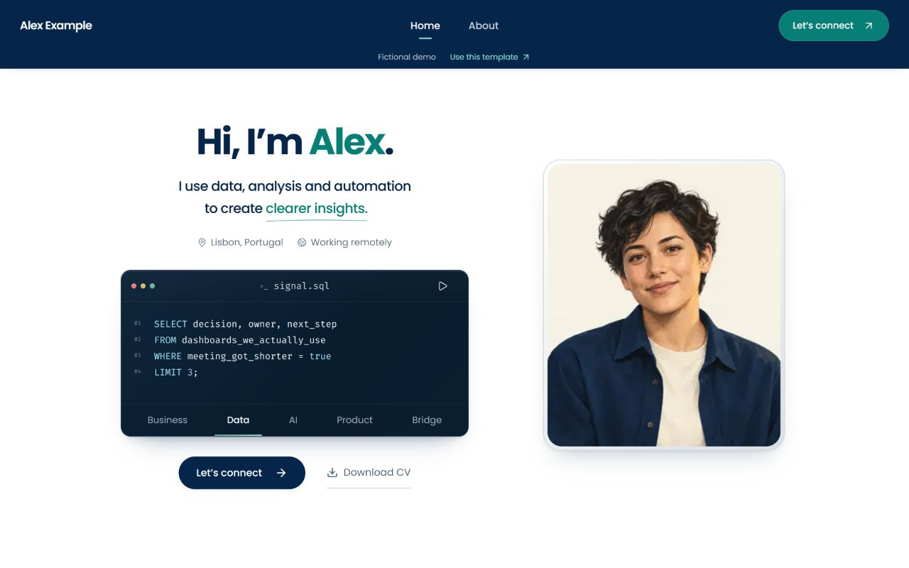
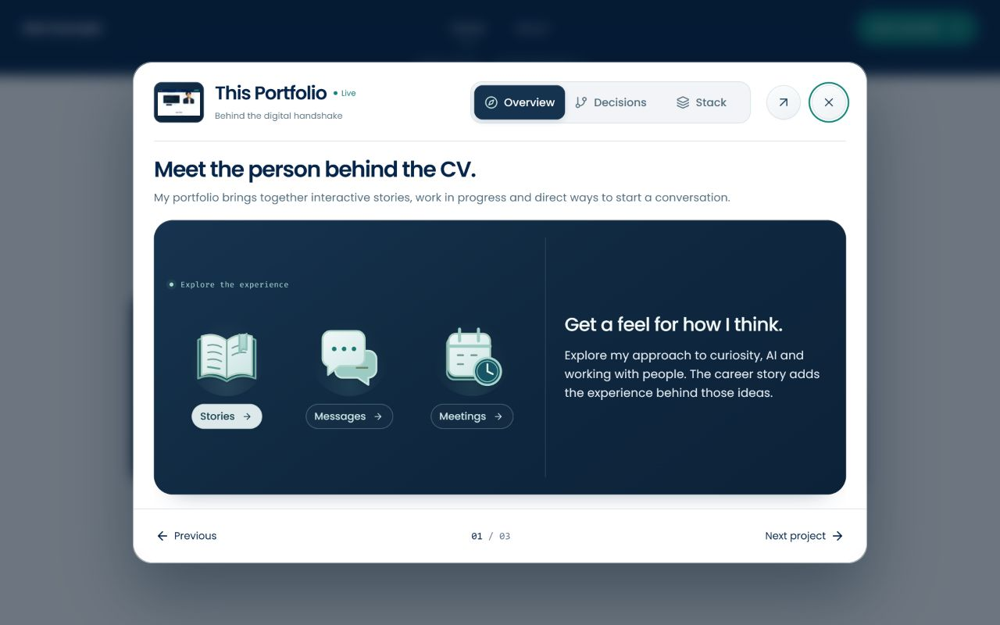
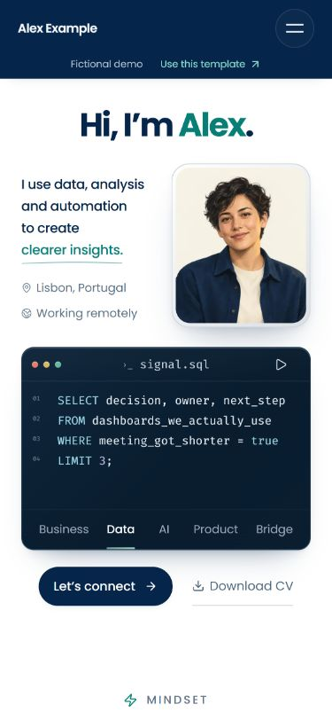

# Career Portfolio Template

[](https://github.com/Gvasi/career-portfolio-template/actions/workflows/ci.yml)
[](LICENSE)
[](package.json)
[](https://vercel.com/new/clone?repository-url=https%3A%2F%2Fgithub.com%2FGvasi%2Fcareer-portfolio-template)

A Next.js and TypeScript starter for a personal portfolio and digital CV, adapted from [my own portfolio](https://www.gvasilakopoulos.com).

A place for the work, interests and small stories that do not quite fit on a CV. Use the whole site, borrow a section, or take an interaction apart and make it your own.

**[Template demo](https://career-portfolio-demo.vercel.app)** · **[My live portfolio](https://www.gvasilakopoulos.com)** · **[Get started](#use-this-template)**



The demo shows the reusable version, with fictional Alex Example content and neutral assets. My live portfolio shows how I use it with my own work and story. Booking and messages in the template demo are simulated: nothing is booked or sent.

Content lives in TypeScript files, with no visual editor or CMS. You should be comfortable editing React and TypeScript, or happy to learn as you go. **The default site needs no service accounts or environment variables.** Contact starts with a direct email link; booking, message delivery and analytics have optional setup.

## Use as much or as little as you need

| Your starting point | A useful next step |
|---|---|
| “I want my own portfolio.” | [Run the whole site](#use-this-template), then replace the example story in the [customisation guide](docs/customisation.md). |
| “I already have a site, but I like that section.” | [Find the section and its dependencies](docs/reuse.md#borrow-a-section). The project reel, career timeline, toolkit and other sections can be adapted separately. |
| “I just want an animation or an idea.” | [Start with the animation guide](docs/reuse.md#borrow-an-animation). Keep a chapter animation, a transition, or the way an interaction responds. |

## Use this template

Requirements: Node.js 22.15 or later (**Node 24 LTS recommended**) and pnpm 10.34.5 (declared in `package.json`). New to running a project locally? [Build your first portfolio](docs/first-portfolio.md) walks through the tools, your first edits and deployment.

1. Choose **Use this template → Create a new repository** on GitHub.
2. Clone your new repository and enter its folder. Replace the two example names below:

   ```bash
   git clone https://github.com/YOUR-USERNAME/YOUR-REPOSITORY.git
   cd YOUR-REPOSITORY
   pnpm install --frozen-lockfile
   pnpm dev                          # http://localhost:3000
   ```

3. Open `http://localhost:3000`. No environment variables are needed to explore the example. Contact uses a direct email link until integrations are configured; change the example address in `src/config/site.ts` before sharing your version.
4. Follow [Customisation](docs/customisation.md) to replace the identity, stories, images, links and sample CV. Run `pnpm check:content`; the untouched example intentionally reports placeholders. See the [test guide](tests/README.md#after-changing-the-example-content) when changing content or removing sections.
5. Run `pnpm check` and the [browser tests](tests/README.md), then follow the [deployment guide](docs/setup.md#deploying).

Start with an introduction, one project you can explain well, and a way to get in touch. The [worked writing example](docs/reuse.md#turn-a-project-into-a-story) helps turn a project into a story. Before sharing, try your site on a phone, follow every link and open the CV.

## What you get

<p>
  <a href="docs/images/template-project.jpg"></a>
  <a href="docs/images/template-mobile.jpg"></a>
</p>

Open either image for a closer look, or [try the demo](https://career-portfolio-demo.vercel.app) to explore the interactions.

- **Show your work:** project walkthroughs with decisions and tools, a career timeline and credentials.
- **Make it personal:** a code-story terminal, animated chapters and an editable toolkit explorer. Keep only the sections you need.
- **Let people reach you:** direct email, with optional booking and message delivery.
- **Support different visitors:** responsive layouts, keyboard interactions, reduced motion and consent-gated analytics.

## Make it yours

Start with these three places. The customisation guide also points out the optional component-level copy and illustration changes.

| where | what |
|---|---|
| `src/config/site.ts` | name, role, location, public URL, public contact address, GitHub/LinkedIn and social profiles, optional chat link, asset paths |
| `src/content/` | `home.ts` (greeting, code stories, How I work chapters, closing phrases), `career.ts` (career chapters, credentials, About intro), `projects.ts` (the project reel and its stories), `toolkit.tsx` (tool catalogue and notes), `contact.ts` (topics and notes) |
| `public/` | your portrait (`images/profile/portrait-source.png`; the sizes are generated), About portrait, career and project illustrations, CV (`documents/sample-cv.pdf`), icons and the six chapter animations |

The example person, employers, certificates and projects are fictional. Replace them before you deploy under your own name.

## Engineering notes

If you want to understand or adapt the implementation, start with the [architecture guide](docs/architecture.md) and [test guide](tests/README.md).

- Public identity and content are separate from server credentials and integrations.
- Booking handles retries and uncertain provider responses, so a failed notification does not become another calendar booking.
- Shared dialogs and motion helpers cover focus handling, reduced motion and work that pauses offscreen, with regression tests for those interactions.

The CI workflow checks types, linting, unit tests and Chromium browser behavior. Optional service calls are mocked in tests; connecting real accounts is a separate setup step.

## Optional integrations

You can deploy a direct-email portfolio without these. Enable only what you need; the [setup guide](docs/setup.md) explains the accounts and variables.

- **Booking and message delivery:** Google Calendar, Meet and Gmail, with your own credentials and private destination inbox.
- **Protection for enabled production submissions:** Cloudflare Turnstile and Redis rate limiting are required for real form submissions and bookings. They are not required to deploy the default direct-email site.
- **Analytics** (PostHog, GA4): public tokens, consent-gated, active only on the `url` you set in `src/config/site.ts`.

The commented [`.env.example`](.env.example) can stay empty for the default site. Integration libraries are included in the install even when their services are disabled.

## Commands

```bash
pnpm dev          # development server on http://localhost:3000
pnpm typecheck    # next typegen + tsc --noEmit
pnpm lint         # eslint
pnpm test:unit    # Node unit tests (tests/unit), services mocked
pnpm test:e2e     # Playwright browser tests (tests/e2e, Chromium; run `npx playwright install chromium` once)
pnpm build && pnpm start
pnpm check        # typecheck, lint, unit tests and build in one go (what CI runs)
pnpm check:content # before your own launch: find leftover example content and missing assets
```

## Stack

Next.js 16.3 · React 19.1 · TypeScript (strict) · Tailwind CSS 4 · Framer Motion 12 · Lottie. See [package.json](package.json) for the full dependency list. Install from the committed lockfile; other versions are untested.

## Scope and known limits

- Browser tests run in Chromium only; WebKit and Firefox are not configured.
- The project reel is covered by synthetic wheel and touch tests; physical mice and trackpads behave differently and are worth a check on your own hardware.
- Booking and delivery are exercised in tests with mocked Google, Turnstile and Redis; real delivery depends on your accounts and configuration.
- Content is code: you edit TypeScript files, not a CMS. A few things still take a component edit (listed in the customisation guide).

## Provenance and maintenance

The template and [my portfolio](https://www.gvasilakopoulos.com) share their starting point, but are versioned separately. This edition replaces personal material with fictional content and redistributable assets. See the [changelog](CHANGELOG.md) for template updates; the two sites may evolve differently.

## Questions and contributions

If you get stuck, open a question with what you are trying to change and the file or page involved. If you borrow something, I would like to see what you made—even if it looks nothing like this site.

Issues and small pull requests are welcome; see [CONTRIBUTING.md](CONTRIBUTING.md). Security reports go to the address in [SECURITY.md](SECURITY.md). If this saved you some work, a star helps other people find it.

**Created by George Vasilakopoulos.** Adapted from my personal portfolio. Code, developer documentation and the example material are offered under the MIT licence ([LICENSE](LICENSE)); [ASSETS.md](ASSETS.md) lists the bundled assets, their origin and their terms.
